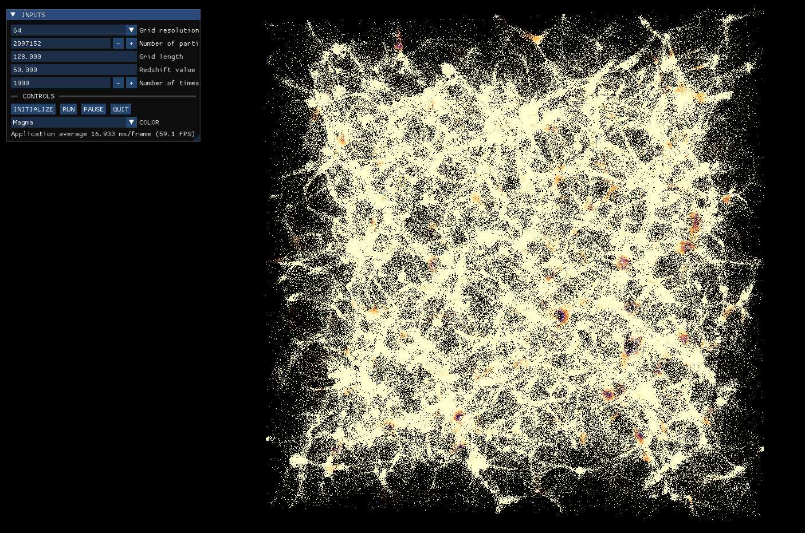
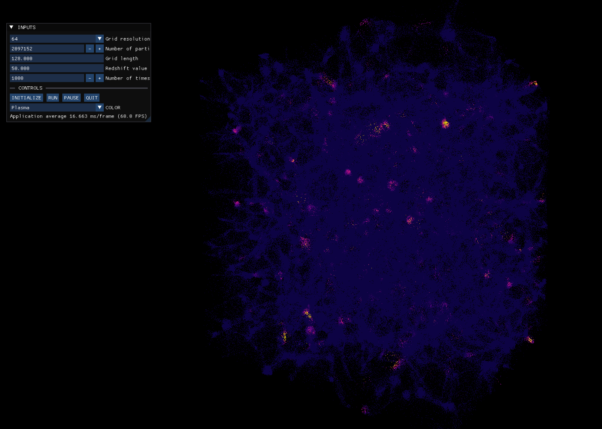

## SpacePeanut

SpacePeanut is a toy cosmology simulator with an Imgui UI and an OpenGL renderer, built on top of SDL3. Shared-memory CPU parallelism utilizing either C++ std::execution or OpenMP is used to allow real-time visualization of simulations containing millions of particles on common laptops.

## Features:
- Arcball camera
- Input and control UI
- Built-in renderer that uses grid mass density to color particles
- Dynamic color palette


## Particle-mesh method
The particle-mesh computational technique allows efficient simulation of gravitational forces in a system of many interacting particles. The primary feature of this method is extremely fast calculation of long-range forces. However, the method neglects to represent short range forces (on the scale of the grid resolution). The method can be broken down into 4 coherent steps:

1. Transfer particle mass to the grid. The cloud-in-cell method is used here for particle<->grid transfer.
2. Calculate grid gravitational potential by solving Poisson's equation. Periodic boundary conditions mean we can use the Discrete Fourier Transform to solve.
3. Calculate grid force by taking the gradient of potential.
4. Interpolate grid force onto the particles using the cloud-in-cell method.

## Building
This project uses CMake with the Ninja build generator. Additional prerequisites include:
- OpenMP or the Intel TBB library, depending on backend used
- OpenGL
- GLEW
- FFTW3

CMake presets are set, so the build is best invoked with one of the following combinations of Release or Debug builds and OpenMP or std::execution backends:
```
cmake --workflow --preset rel-omp
cmake --workflow --preset rel-std
cmake --workflow --preset dbg-omp
cmake --workflow --preset dbg-std
```

## Screenshots





